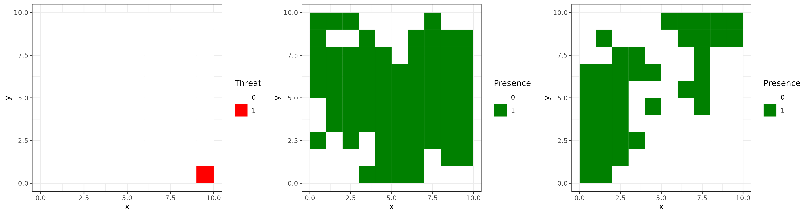
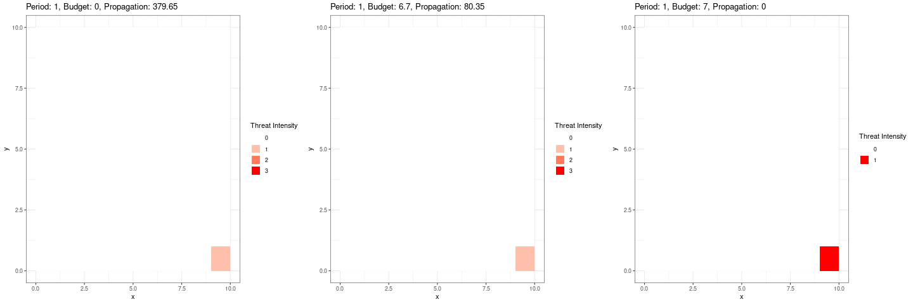
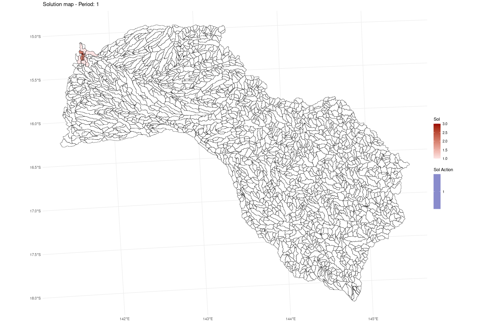
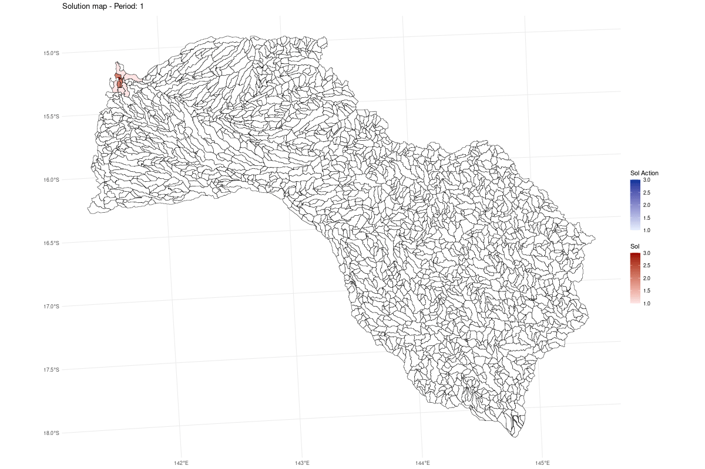

# prioriactionsDynamics: Dynamic Conservation Action Planning with Mathematical Programming

## Overview

The `prioriactionsDynamics` package is a powerful tool designed for
deterministic dynamic mathematical modeling, specifically tailored for
guiding conservation action planning. By utilizing integer programming
models, this package simulates various threats, aiding decision-makers
in determining optimal conservation actions, their locations, and
timing.

Ensure you have the “remotes” package installed. If not, install it
using the following command:

    if (!require(remotes)) install.packages("remotes")
    remotes::install_github("josesalgr/prioriactionsDynamics")

    library(prioriactionsDynamics)

## Usage

The package follows a clear three-step process:

1.  **`instance()`**: Create an instance for simulation or from a file.
    This function generates an instance for simulation or reads from a
    file to create an object with various components. It return a list
    representing the instance with various components.
    -   **`type`**: A character specifying the type of instance. Use
        “simulation” for simulation data or “file” for reading from a
        file.

    -   **`file`**: If type is “file,” the path to the file containing
        the instance data. The instance file has specific structure,
        please see the examples in the folder “inst”.

    -   **`n`**: An integer specifying the number of units (number of
        rows/columns in a grid).

    -   **`species`**: An integer specifying the number of species. All
        species will be simulated.

    -   **`threats`**: An integer specifying the number of threats. If
        `threats_lloc` is `NULL`. The distribution will be simulated.

    -   **`expansionType`**: A matrix specifying the expansion type. The
        matrix contain threats as rows and three columns, the values
        indicate he velocity of propagation. Column 1 = Radial
        Propagation, Column 2 = Downstream Propagation, and Column 3 =
        Upstream Propagation. Threats can propagate in more than one
        direction simultaneously.

    -   **`threats_lloc`**: A matrix specifying threat locations.

    -   **`dlong`**: A matrix specifying Downstream Distances.

    -   **`seed`**: An integer specifying the seed for reproducibility.

Example:

1.  **`model()`**: Create a dynamic model based on input parameters.
    This function takes input parameters and uses them to create a
    dynamic model. The model is designed for dynamic actions, and the
    input should be a list containing various components. It return a
    mathematical model based on the input parameters.
    -   **`input`**: A list containing inputs generated by the
        **`instance()`** function, containing spatial data, threat
        configuration, species presence, and cost information.
    -   **`objective`**: A string specifying the type of objective to
        achieve in the mathematical model. There are two options:
        “min\_prop” (by default) and “max\_relative\_benefit”.
    -   **`levels`**: An integer specifying the number of levels of
        threats intensities in the model. For example, `levels = 4`
        means that threats can range from level 0 (no threat) up to
        level 3 (maximum intensity).
    -   **`periods`**: An integer specifying the number of planning
        periods.
    -   **`budget`**: A numeric scalar specifying the budget per period.

Example:

1.  **`solve()`**: Solve a mathematical optimization problem using
    specified solver. This function takes an optimization problem
    represented by a list of matrices and vectors and solves it using
    either the CBC (install using the package `Rcbc`) or Gurobi solver.
    Return a list containing the solution to the optimization problem,
    including variable values and solver statistics
    -   **`a`**: A list containing information about the optimization
        problem, including coefficients, constraints, and other
        parameters.
    -   **`solver`**: A character specifying the solver to be
        used.Options are:
        -   `'gurobi'`: a commercial solver known for its high
            performance. Academic users can apply for a free license.
            See more at [prioriactions
            documentation](https://prioriactions.github.io/prioriactions/reference/solve.html).
        -   `'cbc'`: an open-source solver that is free to use but may
            have performance limitations for large instances.
    -   **`cores`**: An integer specifying the number of processor cores
        to be used.
    -   **`verbose`**: A logical value indicating whether to print
        solver output.
    -   **`time_limit`**: maximum time allowed for the solver to run, in
        seconds.
    -   **`gap_limit`**: A numeric scalar specifying the relative MIP
        (Mixed-Integer Programming) optimality gap as a stopping
        condition.

Example:

## **Additional Functions**

You can use the following functions to obtain additional information:

-   **`getActions(solution)`**: Retrieve information about conservation
    actions.

-   **`getPropagation(solution)`**: Obtain details about the propagation
    of threats.

These functions can be valuable for further analysis and decision-making
based on the results of your dynamic conservation model.

## **Example of use**

To showcase the capabilities of the `prioriactionsDynamics` package, we
present a simulated example. In this scenario, we begin by defining an
expansion type matrix (`expType`) with a single non-zero element
representing a specific place where the threat appear. We then use the
`instance()` function to generate simulated inputs for a dynamic
conservation model. These inputs include specifications for one threat,
a 10 x 10 grid of units (100 in total), and two species, both responsive
to the threat. With predefined threat locations and the previously
defined expansion type (see the Figure below). Subsequently, we create a
dynamic model (`m1`) using the `model()` function, specifying the
desired maximum levels of intensity of the threat, number of planning
periods, and an annual budget. Finally, we employ the `solve()` function
to solve the optimization problem and obtain the solution (`sol`). This
example provides a starting point for understanding the workflow of the
`prioriactionsDynamics` package, from input generation to solving
dynamic conservation planning problems. Feel free to modify the
parameters and inputs.

In the initial scenario, we employed an expansion type characterized
solely as radial, featuring a velocity of 1 (representing the distance
between centroids of the grid). Additionally, we assumed propagation
between adjacent units. To discern the distinctions between proposed
management strategies, we adjusted the budget accordingly. In blue, the
actions are highlighted, while the threat levels are depicted in red.
The propagation is determined by the sum of the costs of unaddressed
threats.

We obtain:

In the following scenario, we introduce an increased propagation
velocity (of 2 units of distance), and we observe that higher budget
values are required to contain or eliminate the threat.

While these are demonstrative examples, the problem becomes more
intricate when considering additional species or other planning
objectives.

# Case Study: Mitchell River Catchment

## Introduction

This example demonstrates the use of the `prioriactionsDynamics` package
in a realistic conservation planning context. We apply the modeling
approach to the Mitchell River catchment in Northern Australia to
evaluate how varying management budgets influence the effectiveness of
threat containment over space and time. The objective is to design
cost-effective conservation actions under spatially explicit dynamic
threats.

## Data Description

The Mitchell River catchment includes 2,316 sub-catchments and 31
species of freshwater fish, all of which are considered sensitive to at
least one type of threat. The threat propagates radially from a random
location (seed) with a velocity of 1 km per period (Euclidean distance).
Each “unit” in the model corresponds to a sub-catchment polygon.

**Data used**:

-   Spatial boundaries and distances (`SpatVector` or shapefile)
-   Species distributions (binary matrix: species × subcatchments)
-   Threat location and initial level (vector or raster)
-   Cost data (monitoring and action costs per unit)
-   Propagation matrices (based on radial distance)

## Step 1: Load Spatial and Threat Data

In this step, we load the spatial data representing planning units
(sub-catchments) and the input data structure containing species
distribution, threat location, and parameters needed to simulate the
dynamics.

The file `Radial_id118.dat` used in this example follows a structured
plain text format that defines the instance configuration:

-   **`Unidades`**: total number of planning units (e.g., 2316).
-   **`Especies`**: number of species considered in the simulation
    (e.g., 45).
-   **`Amenazas`**: number of dynamic threats (e.g., 1).
-   **`Lboundaries`**: number of lines that define spatial neighborhood
    connections (e.g., 91159), used to simulate adjacency.
-   **`ExpansionType`**: a matrix of 3 columns per threat indicating
    whether the propagation is radial, downstream, or upstream. For
    example, `1 0 0` means radial propagation only.
-   **`Dradial`**: a list of distances between planning units, which
    determines how threats can spread over time.
-   **`Dlong`**: likely represents downstream distances among planning
    units (used in directional propagation models).
-   **`Adyacency`**: defines which units are neighbors (i.e., spatial
    connectivity).
-   **`Ck`**: may refer to the cost associated with applying management
    actions against each threat.
-   **`Ij`, `Ik`, `Jk`**: likely define relationships such as which
    threats affect which species, or other set memberships (e.g.,
    unit-threat-species interactions).

This structure ensures all the necessary elements are in place for
building a dynamic and spatially explicit optimization model.

    # Load the spatial data (planning units and species)
    instance_file_shp <- system.file("extdata/Mitchell_data/", "Fish_Mitchell.shp", package = "prioriactionsDynamics")
    input <- sf::read_sf(instance_file_shp)

    # Load the instance data file and convert it into a structured list for modeling
    # This includes information such as species distributions, initial threat location, cost data, and dynamics settings

    data_file <- system.file("extdata/Mitchell_data/", "Radial_118_v1-rcpp.dat", package = "prioriactionsDynamics")
    data <- prioriactionsDynamics::instance(type = "file", file = data_file)

    # Modify propagation speed for the threat to simulate a high-risk scenario
    # Here, we set the velocity of the threat to 100 units per period for threat 1

    data$ExpansionType$V1 <- 100

## Step 2: Build the Model

In this step, we use the `model()` function to build the mathematical
programming model. This model defines how threats and conservation
actions interact over space and time.

The output is a structured object containing the mathematical
constraints and parameters to be passed to the `solve()` function.

    model_mitchell <- prioriactionsDynamics::model(
      input = data,
      levels = 4,
      periods = 10,
      budget = 100
    )

## Step 3: Solve the Model

In this step, we solve the model built in Step 2 using the `solve()`
function. This function takes the model object and passes it to an
optimization solver. The result includes the allocation of management
actions and the state of threat propagation across the landscape.

    solution <- prioriactionsDynamics::solve(
      a = model_mitchell,
      solver = "gurobi",
      time_limit = 100000,
      gap_limit = 0.01
    )

## Exploring Different Budget Scenarios

In this section, we extend the analysis by exploring how the solution
changes when we vary the available budget. We run the model with three
different budget levels: **100**, **300**, **500**, and **600** units
per period. These scenarios allow us to evaluate the influence of
greater investment on the ability to control threats and implement
actions across the landscape.

### Budget = 100

This is the baseline scenario, using the model already defined and
solved in Steps 2 and 3 with a budget of 100 units per period. The
animation below illustrates how threats (in red) propagate across the
landscape over time and how management actions (in blue) are deployed to
mitigate their impact.

In this scenario, the threat originates in the northwest region and
expands radially. Management actions are sparse and concentrated in very
specific locations, reflecting the limitations of the available budget.
As a result, large portions of the landscape remain unprotected,
allowing the threat to spread freely. High-intensity areas of threat
(darker red) persist without intervention, especially in zones far from
initial containment efforts. This limited response capacity underscores
the trade-offs between spatial coverage and threat suppression. The
scenario clearly shows that with a minimal budget, the spread of the
threat cannot be effectively stopped and continues advancing throughout
the planning horizon.

This case serves as a baseline for comparison against higher-budget
alternatives, helping assess the benefits of increased investment in
conservation action planning.

### Budget = 300

This scenario corresponds to an increased budget of 300 units per
period. The following animation displays the resulting spatial and
temporal dynamics of threat propagation and action deployment under this
moderate investment level.

With this budget level, the management strategy becomes noticeably more
robust. We observe earlier and more spatially distributed actions being
implemented, especially in the zones adjacent to the initial outbreak.
Although the threat still propagates beyond the original location, its
intensity is partially contained in key areas. The blue
regions—indicating implemented actions—are now more widespread and
consistently applied across periods. Despite this, full containment is
not achieved, and the threat continues to reach more distant zones. This
scenario shows that a moderate increase in budget significantly improves
the capacity to respond to the threat, yet limitations remain when
trying to fully suppress its spread. Notably, a portion of the
management actions are strategically implemented in the northern area of
the catchment to prevent the threat from reaching regions where species
richness is highest.

### Budget = 500

This scenario reflects a higher investment of 500 units per period. The
following animation illustrates how this level of budget affects the
spatial allocation of actions and the containment of the threat.

With this budget, the model demonstrates an enhanced capacity to contain
the threat’s progression. The spatial coverage of actions increases
notably, with intervention now occurring in both northern and more
central regions. The threat expansion is slowed substantially, and many
high-risk zones are addressed before reaching higher intensity levels.
While not achieving full eradication, the strategy is clearly more
proactive and widespread, leading to a greater preservation of
biodiversity and strategic resource use across the landscape. In this
case, the increased investment is sufficient to successfully contain the
threat and prevent it from spreading further, although it is not enough
to completely eliminate it from the system.

### Budget = 600

This final scenario corresponds to the highest investment level tested:
600 units per period. The animation below shows the outcome of this
strategy.

At this level of investment, the management strategy is able to not only
contain the threat but also eliminate it entirely from the landscape.
Early intervention and widespread, sustained action prevent the threat
from establishing in new areas. The red zones progressively disappear
while blue areas dominate the map, showing that effective, well-funded
conservation action can lead to complete eradication under the modeled
conditions. This outcome highlights the potential of high-budget
strategies to secure long-term protection for biodiversity.

## Final Remarks

The `prioriactionsDynamics` framework allows researchers and
decision-makers to explore a wide range of management configurations by
modifying key parameters such as the **budget**, the **threat
propagation speed**, or even the **initial distribution and sensitivity
of species and threats**. This flexibility enables customized planning
tailored to local conservation challenges.

It is important to note that this methodology is based on **exact
optimization techniques**, which ensure optimal or near-optimal
solutions under the defined model constraints. However, this also
implies potential **computational challenges**, especially when dealing
with large and complex planning problems. Users should be aware of these
trade-offs and can refer to the benchmarking analysis available at
<https://prioriactions.github.io/prioriactions/articles/benchmark.html>
for more information about performance expectations in different
solvers.

## **License**

This project is licensed under the [MIT
License](https://chat.openai.com/c/LICENSE.md).
